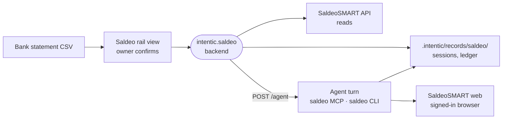

# intentic-saldeo

An intentic extension for SaldeoSMART that lets the agent and the owner match bank payments to open invoices, confirm the matches, and have the agent mark them paid.



- Two capability cards. `saldeosmart` takes a login and API token, and its scope switches decide which tools the agent gets. `saldeosmart-web` is a signed-in browser profile: the API cannot mark anything paid, so confirmed settlements go through the web app.
- Four halves share the types in `src/core/contract.ts`: the Vue rail view (`src/view/`), the backend under the extension's `/x` namespace (`src/server/server.ts`), the stdio MCP server the plugin spawns each turn (`src/mcp/server.ts`), and the `saldeo` CLI on the agent's PATH (`src/cli/saldeo.ts`).
- A reconciliation session starts from an imported bank CSV (`src/core/bank/`, with presets for Polish banks). `src/core/match/engine.ts` scores candidate invoices and gives reasons, and nothing is settled until the owner confirms. The backend then starts an isolated, unattended agent turn with the run role `saldeo-reconcile`.
- State is JSON under `.intentic/records/saldeo/<account>/`, shared by every worktree and written atomically with a version check. Money is integer grosze.
- `src/core/saldeo/client.ts` signs each API request and sends calls one at a time to stay within SaldeoSMART's rate limit.

## Key files

- [intentic-extension.json](intentic-extension.json) — the capability cards, their fields and the env they map to.
- [src/core/service.ts](src/core/service.ts) — the operations every half calls.
- [src/core/match/engine.ts](src/core/match/engine.ts) — the deterministic matcher and its scoring.
- [src/server/server.ts](src/server/server.ts) — the backend routes and the two agent turns it starts.
- [src/mcp/server.ts](src/mcp/server.ts) — the agent's tools, gated by the card's switches.
- [src/extension.ts](src/extension.ts) — one rail tile per connected account, badged with pending decisions.

## Commands

```sh
pnpm install
pnpm verify    # build, typecheck, test
```
